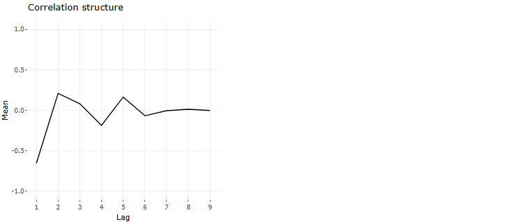
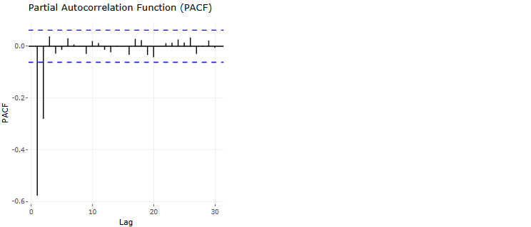

```{r setup, include=FALSE}
knitr::opts_chunk$set(
  message = FALSE,
  warning = FALSE,
  echo = FALSE,
  comment = NA
)
library(DT)
# library(webshot2)
# library(pagedown)
library(plotly)
library(knitr)
library(kableExtra)

# Only load these for non-HTML outputs
if (!knitr::is_html_output()) {
  library(ggplot2)
}
```

This is a dynamic report automatically generated by the LMMCov app (<https://zq9mvv-vub0square.shinyapps.io/LiMMCov-research-tool/>). It consists of sections that include the generalised linear model (GLM) model, a summary of the covariance analysis and the fitted linear mixed model (LMM) model.

### GLM Analysis

#### Model Summary

\hfill\break

The table below provides a summary of the GLM model, showing the estimated coefficients, and p-values. \hfill\break

```{r}
params$glm_summary
```

\newpage

### Covariance Analysis

Details on the covariance structure depicted by the residuals from the GLM model and how they impact the model fit and interpretation. 
\hfill\break

#### Residual plot from the GLM based on the correlation matrix 
\hfill\break 

The residual plot helps in identifying the underlying correlation structure in the repeated measures. 

```{r fig.width=8, fig.height=6}
# p1 <- params$glm_residuals
# 
# if (knitr::is_html_output()) {
#   # Render Plotly plot for HTML output
#   p1
# } else {
#   # Save Plotly plot as an image for PDF/Word output
#   saveWidget(p1, "glm_residuals.html", selfcontained = TRUE)
#   webshot("glm_residuals.html", "glm_residuals.png", zoom = 0.75)
#   
# }

if (knitr::is_html_output()) {
  # Interactive Plotly plot for HTML
  params$glm_residuals
} else {
  # Static ggplot for PDF/Word
  # Convert plotly object to ggplot if possible, or use a pre-generated static version
  # If your app passes a plotly object, you'll need to pass a ggplot version instead
  # For now, this assumes you'll modify the app to pass both versions
  if (!is.null(params$glm_residuals_static)) {
    params$glm_residuals_static
  } else {
    # Fallback: try to extract ggplot from plotly object
    tryCatch({
      params$glm_residuals$x$data
    }, error = function(e) {
      plot(1, type = "n", xlab = "", ylab = "", main = "Plot not available in this format")
    })
  }
}


```

\newpage

#### Partial Autocorrelation function (PACF) plot from GLM model

\hfill\break

The PACF plot shows the correlation of the residuals with themselves over different time lags. This helps in identifying any patterns or correlations that exist in the residuals.

```{r fig.width=8, fig.height=6}
# p2 <- params$glm_acf
# 
# if (knitr::is_html_output()) {
#   # Render Plotly plot for HTML output
#   p2
# } else {
#   # Save Plotly plot as an image for PDF/Word output
#   saveWidget(p2, "glm_acf.html", selfcontained = TRUE)
#   webshot("glm_acf.html", "glm_acf.png", zoom = 0.75)
#   
# }

if (knitr::is_html_output()) {
  # Interactive Plotly plot for HTML
  params$glm_pacf
} else {
  # Static ggplot for PDF/Word
  if (!is.null(params$glm_pacf_static)) {
    params$glm_pacf_static
  } else {
    tryCatch({
      params$glm_pacf$x$data
    }, error = function(e) {
      plot(1, type = "n", xlab = "", ylab = "", main = "Plot not available in this format")
    })
  }
}

```

\newpage

### LMM Analysis

#### Model summary

\hfill\break

The table below summarises the LMM with the selected covariance structure. \hfill\break

```{r}
params$lmm_summary
```

\newpage

#### Model comparison using AIC

\hfill\break

The table below compares the AIC values for different models fitted with random effects and the covariance structure. This identifies which model best fits the data while accounting for complexity. 

```{r}
# if (knitr::is_html_output()) {
#   # Render DT table for HTML output
#   DT::datatable(params$aic_table, options = list(dom = 't', paging = FALSE), style = 'bootstrap', class = 'table table-striped table-bordered', rownames = FALSE) %>%
#     DT::formatStyle(columns = 1:ncol(params$aic_table), `text-align` = 'left')
# } else {
#   # Render table with kable for PDF/Word output
#   knitr::kable(params$aic_table, format = "latex", booktabs = TRUE, longtable = TRUE) %>%
#     kableExtra::kable_styling(latex_options = c("hold_position", "striped"))
# }

if (knitr::is_html_output()) {
  # Interactive DT table for HTML output
  DT::datatable(
    params$aic_table, 
    options = list(dom = 't', paging = FALSE), 
    style = 'bootstrap', 
    class = 'table table-striped table-bordered', 
    rownames = FALSE
  ) %>%
    DT::formatStyle(columns = 1:ncol(params$aic_table), `text-align` = 'left')
} else {
  # Static table for PDF/Word output
  knitr::kable(
    params$aic_table, 
    format = "simple",
    booktabs = TRUE,
    row.names = FALSE
  ) %>%
    kableExtra::kable_styling(
      latex_options = c("hold_position", "striped"),
      full_width = FALSE
    )
}

```
